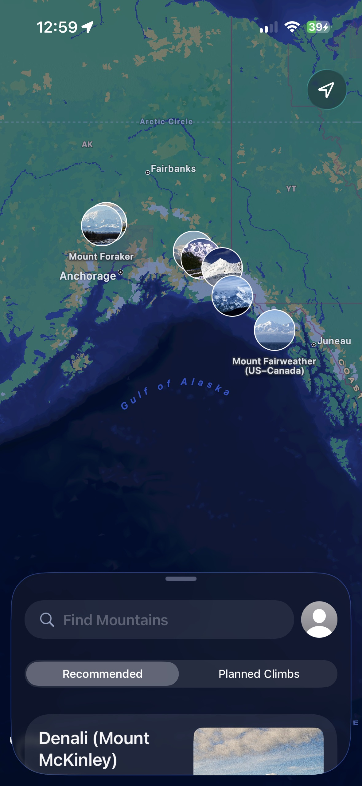
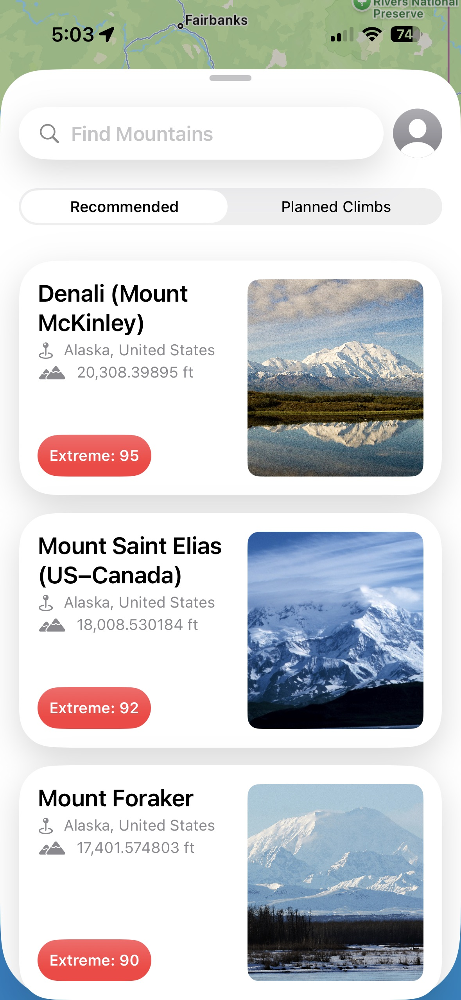
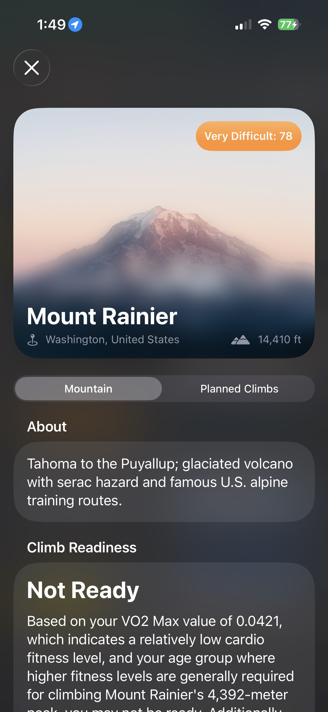
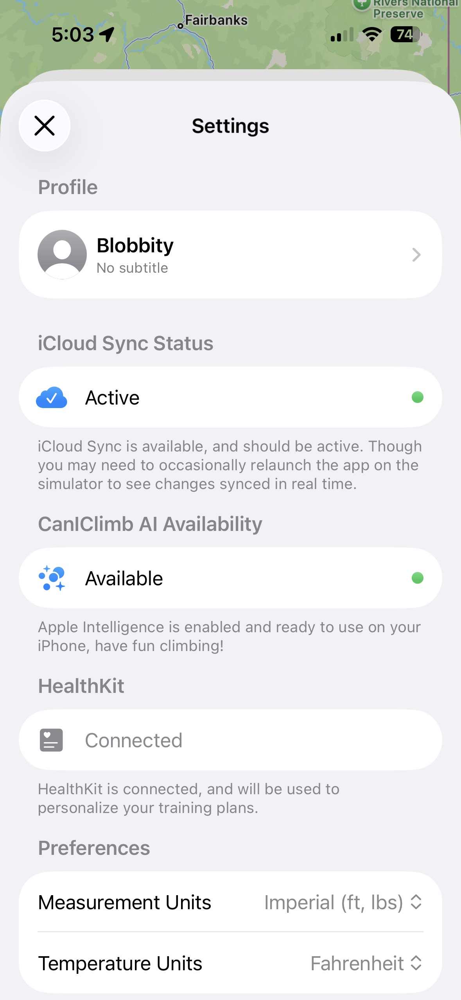

# CanIClimb
CanIClimb is an app put together to show off the library in moderately realistic scenario involving authentication, offline support, LLMs, integration with common Apple Frameworks, SQLite persistence, and more. The app fetches data about mountains that you can climb, and strings together multiple Apple Frameworks, including FoundationModels and HealthKit, to determine your ability to climb a mountain of your choosing.

  
  
  
  

## Features
In no particular order.
- Browse cool mountains (with Debounced Search + Infinite Scroll).
- Plan climbs (with alarms using AlarmKit).
- Evaluate whether or not you’re ready to climb a mountain (using HealthKit + FoundationModels)
- Onboarding Flow
- Travel Estimates
- Current Weather Reports
- Authentication/Account Management
- CloudKit sync for on-device data (using SQLiteData)

> [!NOTE]
> Do note, while the app is written in a manner that acts as if it were connecting to a live API over the network, the backend is entirely simulated in memory for this demo app with the exception of the list of mountains being downloaded from a remote JSON file. See the [DummyBackend](https://github.com/mhayes853/swift-operation/tree/main/Examples/CanIClimb/CanIClimbKit/Sources/CanIClimbKit/API/DummyBackend) directory for the implementation of this simulated backend.

## Architecture
In terms of patterns, this app uses the library in an MVVM style architecture with `@Observable` models since the app is largely a read-only app with only some interactions. The `@SharedOperation` property wrapper works in observable models because of its usage of the `@Shared` property wrapper from [Sharing](https://github.com/pointfreeco/swift-sharing) under the hood.

Each operation struct generally utilizes a protocol injected through the `@Dependency` property wrapper instead of a concrete type directly. This made it easy to create many different UI previews, and even made testing easier by allows mocks to be injected. The result was that most operation structs are pretty straight forward. They tend to just call the methods on the protocol injected into them, and then do some state management work with the operation client.

Generally, the protocols that the operations depend on are small (usually only 1-2 requirements). This makes it easy to create custom mock conformances tailored to specific previews or tests. At the same time, a larger class would generally be responsible for implementing multiple of these smaller protocols at a time. I think this method of doing things just has more flexibility in the long run, even if it’s at the cost of some fragmentation.

Some data, such as preferences, is represented locally, and additionally all the data that comes over the network needs to be cached to enable offline support. [SQLiteData](https://github.com/pointfreeco/sqlite-data) is used to interact with and store this data, and it’s `SyncEngine` even enables it to be synced across iCloud.

I also managed to create an async/cached image loader using some basic tools in the library, though I don’t recommend implementing it the way I did in a more sophisticated app. I merely found it interesting that it was technically possible. The cache is a simple disk cache, and the `StoreCache` inside `OperationClient` serves as the in-memory cache layer. I didn’t take too much care to properly manage the memory of the in-memory cache layer either. I think if you’re going to use the library for image loading, I would have your operations wrap a robust image loading library like [Nuke](https://github.com/kean/Nuke).
