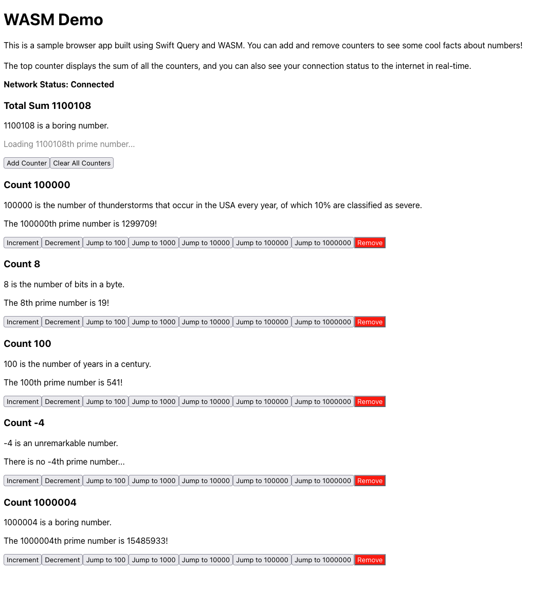

# WASMDemo

A simple demo of how to use Swift Query and WASM to build a browser application.

Inspired by [PointFree's](https://www.pointfree.co/) obsession with counters, the app is a simple counter app that displays a cool fact of the current number, and the nth prime number of the current number.



You can see how Swift Query will easily remember the state of previous queries as you increment and decrement each counter. If you switch to another browser tab, then back to the app, the app will automatically refresh the latest data from the number fact API.

The app makes use of the `SharingQuery` integration such that it can use the `@SharedQuery` property wrapper, and uses [swift-dependencies](https://github.com/pointfreeco/swift-dependencies) for dependency injection within queries. [JavaScriptKit](https://github.com/swiftwasm/JavaScriptKit) is used to interact with the browser's DOM, render the UI, and perform network requests.

Calculating the nth prime number is a blocking computation that takes a while for large numbers, so this project also shows off how one can use `WebWorkerTaskExecutor` from JavaScriptKit to avoid blocking the browser UI thread. The executor is combined with the `taskConfiguration` query modifier, which lets you set the `TaskExecutor` preference of the query. See the [Task Executor Preference](https://github.com/swiftlang/swift-evolution/blob/main/proposals/0417-task-executor-preference.md) for more on how task executors work.

Lastly, the app has a test suite written in XCTest for all of its business logic, which should serve as an example of how to write tests for your queries in the context of your app's architecture.

## Running the App

Make sure you have the latest swift toolchain (not the one from Xcode) installed. You can use [swiftly](https://github.com/swiftlang/swiftly) to install it.

Then, you need to install the WASM sdk.

```sh
swift sdk install https://github.com/swiftwasm/swift/releases/download/swift-wasm-6.1-RELEASE/swift-wasm-6.1-RELEASE-wasm32-unknown-wasip1-threads.artifactbundle.zip --checksum 0dd273be28741f8e1eb00682c39bdc956361ed24b5572e183dd8a4e9d1c5f6ec
```

Then you can run the app by running `run-dev.sh`.
